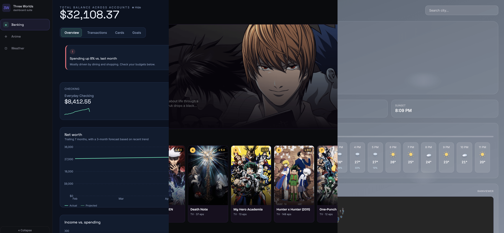

<div align="center">
  <br />

  <p align="center">
  
  </p>

  <h1>🌍 Three Worlds</h1>

  <p>
    One frontend shell, three completely different dashboards.<br/>
    Banking, Anime, and Weather — switchable from a single sidebar, each with its own visual identity, data source, and signature motion.
  </p>

  <br />

  <div>
    
    
    
    
    
    
    
   
  </div>
</div>

## 📋 Table of Contents

1. 🤖 [Introduction](#introduction)
2. ⚙️ [Tech Stack](#tech-stack)
3. 🔋 [The Three Worlds](#the-three-worlds)
4. 🤸 [Quick Start](#quick-start)
5. 🗂️ [Project Structure](#project-structure)
6. 🧪 [Testing](#testing)
7. 🕸️ [Snippets](#snippets)
8. 📌 [Notes / Things You May Want to Tweak](#notes--things-you-may-want-to-tweak)

## <a name="introduction">🤖 Introduction</a>

Three Worlds is a single React app that houses three unrelated dashboards behind one shell: a Banking dashboard running on deterministic local dummy data, an Anime dashboard backed by AniList's public GraphQL API, and a Weather dashboard backed by Open-Meteo and RainViewer. Nothing is fetched from a server Claude — or anyone else — controls; there's no backend, no auth, and no API keys required anywhere in the stack.

Every world was built to stand on its own: its own color system, its own font pairing, its own GSAP-driven signature motion (a FLIP shared-element transaction drill-down for Banking, a live countdown badge for Anime, a canvas particle system driven by real weather codes for Weather), while sharing one sidebar and one animated loading screen so the app still feels like a single product rather than three demos stapled together.

## <a name="tech-stack">⚙️ Tech Stack</a>

- **React 18** + **TypeScript**
- **Vite 5**
- **Tailwind CSS v4** — theme tokens live in `src/index.css` via `@theme`, no `tailwind.config.js` needed
- **GSAP** — every animation in the app: sidebar indicator, loading screen, card reveals, count-up numbers, hover tilt, FLIP transitions, weather icon motion
- **Recharts** — income/spending, net worth, score histogram, and money-flow Sankey charts
- **Leaflet** — the live precipitation radar map
- **jsPDF + jspdf-autotable** — real, client-generated account statement and receipt PDFs

## <a name="the-three-worlds">🔋 The Three Worlds</a>

### 1. Banking — dummy data, no API

All data lives in `src/data/bankingData.ts`, generated by a seeded pseudo-random function so it's stable across reloads but easy to regenerate. It behaves like its own mini-app, with local sub-tab navigation rather than one long scrolling page:

👉 **Overview** — animated sparkline account cards with a hide/show balance toggle, a live-ticking count-up total balance, a 7-month net worth trend with a 3-month forecast, income vs. spending, Apple Watch–style budget rings, a money-flow Sankey diagram, and an auto-rotating insights carousel.

👉 **Transactions** — search, category filters, sorting, and a true FLIP shared-element drill-down that visibly grows out of the row you clicked, complete with a "Download receipt (PDF)" button and a full "Export statement (PDF)" from anywhere in the dashboard.

👉 **Cards** — a mouse-tracked glare/tilt card carousel, freeze/unfreeze, a spending-limit slider, and virtual-number reveal + copy-to-clipboard.

👉 **Goals** — savings goals with animated fill bars and a subscriptions tracker.

👉 **Always on** — a live-activity simulator that drops a new "pending → posted" transaction every 15–30 seconds, a `⌘K` command palette, and a light/dark toggle scoped entirely to the banking dashboard via CSS custom-property overrides.

### 2. Anime — AniList API, no key required

`src/lib/animeApi.ts` talks directly to AniList's public GraphQL endpoint. A rotating hero banner with real YouTube trailer embeds, a live second-by-second next-episode countdown, and a detail modal that loads a richer per-title query on open — community score histogram, characters + voice actors, official watch links, and AniList's own "more like this" recommendations, which you can click through indefinitely without ever closing the modal.

### 3. Weather — Open-Meteo, RainViewer, and Leaflet, no keys required

`src/lib/weatherApi.ts` uses Open-Meteo's free geocoding, forecast, and air-quality endpoints, with a request for browser geolocation (falling back to New York). A full-bleed canvas renders actual rain, snow, drifting clouds, light motes, or stars depending on the live weather code and time of day; an interactive hourly scrubber lets you preview any hour across the whole hero card; a Leaflet map overlays real animated RainViewer radar frames; and a computed 0–100 outdoor score explains itself in plain English.

## <a name="quick-start">🤸 Quick Start</a>

**Prerequisites:** [Node.js](https://nodejs.org/en) and npm.

```bash
git clone <your-repo-url>
cd three-worlds-dashboard
npm install
npm run dev
```

Open the printed local URL (default `http://localhost:5173`). No environment variables, no API keys, nothing to provision.

To build for production:

```bash
npm run build
npm run preview
```

## <a name="project-structure">🗂️ Project Structure</a>

```
src/
  App.tsx                  # shell: active world, loading transitions
  components/
    shell/                 # Sidebar, LoadingScreen
    banking/               # Banking dashboard + widgets
    anime/                 # Anime dashboard + widgets
    weather/               # Weather dashboard + widgets
  data/bankingData.ts       # deterministic dummy banking data
  lib/
    animeApi.ts             # AniList GraphQL client
    weatherApi.ts           # Open-Meteo client
    rainviewerapi.ts        # RainViewer radar frames client
    statementPdf.ts          # jsPDF statement + receipt generation
  hooks/
    useGsapReveal.ts         # stagger-in reveal hook
    useCountUp.ts            # GSAP number count-up hook
    useLiveActivity.ts       # simulated live transaction feed
  types/                    # banking / anime / weather types
tests/
  bankingData.test.ts        # seeded generator, running balances, money flow
  weatherApi.test.ts          # weather-code + AQI classification
  animeApi.test.ts             # HTML-stripping / description normalization
```

## <a name="testing">🧪 Testing</a>

This app is mostly GSAP tweens, canvas particle loops, and a Leaflet map — code that's genuinely low-value and high-friction to unit test, since a passing test there mostly proves a tween fired, not that anything meaningful works. Rather than pad the suite with that, testing is scoped deliberately to the parts of the codebase that are pure, deterministic, and don't touch the DOM:

- **`bankingData.ts`** — the seeded transaction generator producing stable output across runs, the running-balance math reconciling transaction deltas back to each account's current balance, and the Sankey graph builder (`buildMoneyFlow`) producing valid, balanced nodes/links.
- **`weatherApi.ts`** — WMO weather-code → label/icon classification and the US AQI breakpoint → label/color mapping (`describeWeatherCode`, `describeAqi`).
- **`animeApi.ts`** — the HTML-stripping/normalization step that turns AniList's raw `description` field into clean display text.

Run the suite with:

```bash
npm run test
```

Anything involving GSAP timelines, the canvas weather particles, Leaflet, or FLIP transitions is intentionally left to manual/visual QA — testing that a `gsap.to()` call was invoked doesn't tell you the animation looks right, and mocking the DOM/canvas APIs to make it "testable" would cost more than it proves.


## <a name="snippets">🕸️ Snippets</a>

<details>
<summary><code>src/data/bankingData.ts</code> — deterministic seeded random, not <code>Math.random()</code></summary>

Balances and history need to look organic but be stable across reloads (and testable), so the whole data layer runs on a tiny linear-congruential generator seeded per-account instead of the real RNG:

```typescript
function seededRandom(seed: number) {
  let value = seed;
  return () => {
    value = (value * 9301 + 49297) % 233280;
    return value / 233280;
  };
}

function buildHistory(seed: number, base: number, points = 30, drift = 0.4) {
  const rnd = seededRandom(seed);
  const history: number[] = [];
  let current = base * (1 - drift * 0.5);
  for (let i = 0; i < points; i++) {
    current += (base * drift) / points + (rnd() - 0.5) * base * 0.02;
    history.push(Math.round(current * 100) / 100);
  }
  history[history.length - 1] = base;
  return history;
}
```

</details>

<details>
<summary><code>src/components/banking/TransactionDetail.tsx</code> — a real FLIP shared-element transition</summary>

Clicking a transaction row doesn't just fade in a modal — the detail panel measures its own resting position, then GSAP animates it in from the exact rect of the row that was clicked (Invert), and back out again on close:

```typescript
const finalRect = panel.getBoundingClientRect();
const scaleX = originRect.width / finalRect.width;
const scaleY = originRect.height / finalRect.height;

gsap.fromTo(
  panel,
  { x: originCenterX - finalCenterX, y: originCenterY - finalCenterY, scaleX, scaleY, opacity: 0.5 },
  { x: 0, y: 0, scaleX: 1, scaleY: 1, opacity: 1, duration: 0.55, ease: "power3.out" }
);
```

</details>

<details>
<summary><code>src/index.css</code> — re-theming a whole dashboard by overriding CSS custom properties</summary>

Tailwind v4 utilities like `bg-bank-bg` compile to `var(--color-bank-bg)`, so the banking dashboard's light mode is just those variables redeclared inside a scoped class — no component touches a `dark:`/`light:` variant anywhere:

```css
.bank-light {
  --color-bank-bg: #f2f5fa;
  --color-bank-surface: #ffffff;
  --color-bank-text: #101a2b;
  --color-bank-mint: #12a983;
}
```

</details>

## <a name="notes--things-you-may-want-to-tweak">📌 Notes / Things You May Want to Tweak</a>

- The banking data is entirely local — swap `src/data/bankingData.ts` for a real backend later without touching a single component.
- Anime search is debounced (450ms) client-side.
- Weather geolocation permission prompt appears immediately on first visit to the Weather tab; denying it just keeps the New York default.
- Everything is styled with Tailwind v4 design tokens defined once in `src/index.css` under `@theme` — edit colors there and they propagate everywhere (e.g. `--color-bank-mint`, `--color-anime-magenta`).